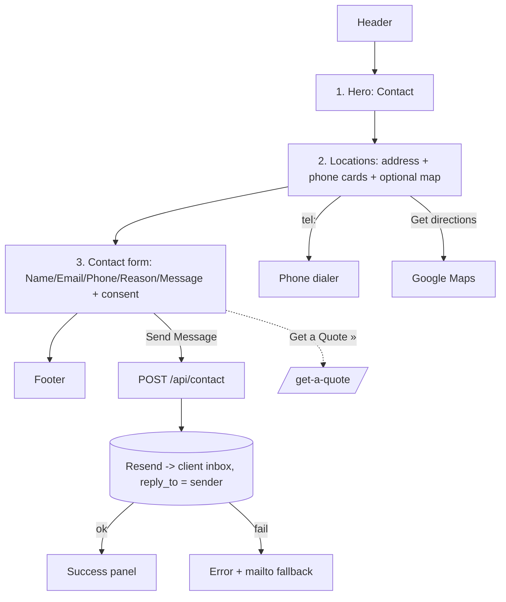

# Contact Us Page — Layout & Content Reference

Reference URL: https://reliancepartners.com/contact/

## 1. Page overview

Contact hub: office location(s) with address + phone, plus a contact form that emails the
client. The reference page lists 8 offices and reuses the same "Get A Quote" form; for the
clone we keep **one (or few) real client location(s)** and a **simple contact form** (per the
proposal: "Contact Us (with Contact Form)"). Single-column scroll.

Page has **3 content sections** (+ header/footer).

## 2. Complete section-by-section breakdown

| # | Section | Purpose |
|---|---------|---------|
| 0 | Header / nav | Global |
| 1 | Hero / title | "Contact" + one line |
| 2 | Locations | Address + phone cards (+ optional map) |
| 3 | Contact form | Name/email/phone/message → email to client |
| 4 | Footer | Global |

## 3. Content / text

### Section 1 — Hero
- **H1:** "Contact"
- **Body (optional):** "Questions about coverage, claims, or a certificate? Reach us at the
  office below or send a message and we'll get back to you."

### Section 2 — Locations
Reference lists these (replace with the client's real office(s)):

| Office | Address | Phone |
|--------|---------|-------|
| Chattanooga (HQ) | Mailing: PO Box 11227, Chattanooga, TN 37401 · Physical: 555 Walnut Street, Suite 400, Chattanooga, TN 37402 | 877.668.1704 |
| Austin | 501 South Austin Avenue, Suite 1220, Georgetown, TX 78626 | 512.738.8897 |
| Birmingham | 6801 Cahaba Valley Road, Suite 208 E, Birmingham, AL 35242 | 205.644.8613 |
| Chicago | 222 S Prospect Ave, 3rd Floor, Park Ridge, IL 60068 | 773.337.3957 |
| Milwaukee | 1035 W Glen Oaks Lane, Suite 202, Mequon, WI 53092 | 262.289.4447 |
| Nashville | 4900 Centennial Blvd, Suite 300, Nashville, TN 37209 | 877.668.1704 |
| Tampa | 8270 Woodland Center Blvd, Tampa, FL 33614 | 813.535.7821 |
| Scottsdale | 4150 N Drinkwater Blvd, Suite 230, Scottsdale, AZ 85251 | 877.668.1704 |

Each location card: office name, address (mailing + physical if different), `tel:` phone,
optional "Get directions" link (Google Maps), optional email.

### Section 3 — Contact form
Simple form (lighter than the quote form):

| Field | Type | Required |
|-------|------|----------|
| Name | text | Yes |
| Email | email | Yes |
| Phone | tel | Yes |
| Subject / Reason | text or dropdown (General / Claims / Certificate request / Billing) | No |
| Message | textarea | Yes |
| Consent checkbox | checkbox | Yes |

- **Disclaimer (from reference):** consent to be contacted re: insurance products and quotes;
  message/data rates may apply; reply STOP to unsubscribe.
- **Button:** `Send Message`
- On submit → email to client inbox via Resend (`reply_to` = submitter email). Success/error
  states same pattern as the quote form.

## 4. Layout structure

- Single column, ~1100px, centered.
- **Hero:** short full-width band, H1 + optional line.
- **Locations:** card grid — 3-up desktop / 2-up tablet / 1-up mobile. If only one client
  office, use a single wide 2-column card (details left, embedded map right).
- **Map:** optional embedded Google Map (iframe) or static map image per location, or one
  map for the HQ.
- **Contact form:** centered, max width ~640px; Name/Email/Phone can be 2-up on desktop,
  Message full width; Send button full-width on mobile.
- Locations and form can be side-by-side (2-col) on wide screens or stacked — stacked is
  simpler and fine.

## 5. Component breakdown

- `SiteHeader`, `SiteFooter` (global)
- `Hero` (h1, body) — text variant
- `LocationCard` ×N (name, mailingAddress?, physicalAddress, phone, directionsUrl?, email?)
- `LocationGrid`
- `MapEmbed` (lat/lng or query) — optional
- `ContactForm` (client island): `TextField`, `EmailField`, `PhoneField`,
  `SelectField` (reason), `TextAreaField`, `ConsentCheckbox`, `SubmitButton`, `FormResult`
- **Server:** `POST /api/contact` → validate → `resend.emails.send({ to: CONTACT_INBOX, reply_to })`.

## 6. Visual hierarchy

1. H1 "Contact".
2. Send Message button (solid brand).
3. Section headings ("Our Office" / "Send us a message").
4. Location office names (H3) + phone numbers (prominent, link-styled).
5. Addresses + form labels — base size.
6. Consent / disclaimer — small print, legible.

## 7. CTA / button details

| Location | Label | Style | Action |
|----------|-------|-------|--------|
| Header | Get a Quote | Solid brand button | `/get-a-quote/` |
| Location card | [phone] | `tel:` link | dial |
| Location card | Get directions | Text link | Google Maps (new tab) |
| Location card | [email] | `mailto:` link | compose |
| Contact form | Send Message | Solid brand button, full-width mobile | validate → POST → email |
| (optional) below form | Need a quote instead? Get a Quote » | Text link | `/get-a-quote/` |

## 8. Image / media requirements

- Optional hero background or brand colour band.
- Optional map embed/static image per location (~800×500).
- Small icons: phone, pin/location, envelope. Line style, one colour.
- No other imagery required.

## 9. User interactions

- Sticky header + mobile hamburger.
- `tel:` / `mailto:` / directions links work on tap.
- Map iframe lazy-loaded (perf); or click-to-load placeholder.
- Contact form: inline validation on blur; Submit disabled + spinner while sending;
  success replaces form with "✓ Thanks, we'll reply to [email] soon"; error keeps data and
  shows a banner + fallback `mailto:` to client.
- Reason dropdown (if used) can tweak-route the email subject line
  (e.g. `Contact — Claims`).
- AX: labelled inputs, `aria-describedby` errors, focus management, keyboard-operable.

## 10. Page layout diagram

### ASCII wireframe

```
┌───────────────────────────────────────────────────────────────┐
│ [LOGO]        Our Difference  Services  Contact  [GET A QUOTE] │  Header
├───────────────────────────────────────────────────────────────┤
│  H1: Contact                                                  │  1 HERO
│  Questions about coverage, claims, or a certificate? …        │
├───────────────────────────────────────────────────────────────┤
│  H2: Our Office(s)                                            │  2 LOCATIONS
│  ┌───────────────┐ ┌───────────────┐ ┌───────────────┐        │  card grid
│  │ Office name   │ │ Office name   │ │ Office name   │        │
│  │ 📍 address    │ │ 📍 address    │ │ 📍 address    │        │
│  │ ☎ phone       │ │ ☎ phone       │ │ ☎ phone       │        │
│  │ Get directions│ │ Get directions│ │ Get directions│        │
│  └───────────────┘ └───────────────┘ └───────────────┘        │
│  (optional embedded map for HQ)                               │
├───────────────────────────────────────────────────────────────┤
│  H2: Send us a message                                        │  3 CONTACT FORM
│  Name* [__________]        Email* [_______________]           │
│  Phone* [_________]        Reason [ General ▼ ]               │
│  Message* [ textarea …………………………………………………… ]                 │
│  [x] I agree to be contacted … (consent + disclaimer)         │
│                 [   Send Message   ]                          │
│  Need a quote instead? Get a Quote »                          │
├───────────────────────────────────────────────────────────────┤
│  (after submit) ✓ Thanks — we'll reply to your email soon.   │  SUCCESS STATE
├───────────────────────────────────────────────────────────────┤
│  FOOTER                                                       │
└───────────────────────────────────────────────────────────────┘
```

### Mermaid — structure & flow



## 11. Implementation notes

- **Use the client's real office(s)** — replace the entire Reliance location table. If the
  client has one location, do a single wide card + map; if remote-only, replace with
  "Email / phone / hours" block and no address.
- Contact form is deliberately simpler than the quote form: **no file uploads** (proposal
  scope). If the client wants attachments here too, reuse `FileUploadRow` from
  `get-a-quote.md` with the same 3 MB cap.
- Two email endpoints total for the site: `/api/quote` and `/api/contact` — can share one
  Resend client + one helper. Different `to` inbox / subject prefix is enough.
- Same anti-spam approach as the quote form (honeypot + Turnstile).
- Keep a visible fallback (`mailto:` + phone) near the form in case email sending fails.
- Reuse `Hero`, form field components, `FormResult`, `SiteHeader/Footer`.
- AX + perf: lazy-load any map iframe; provide a text address as the accessible fallback.
