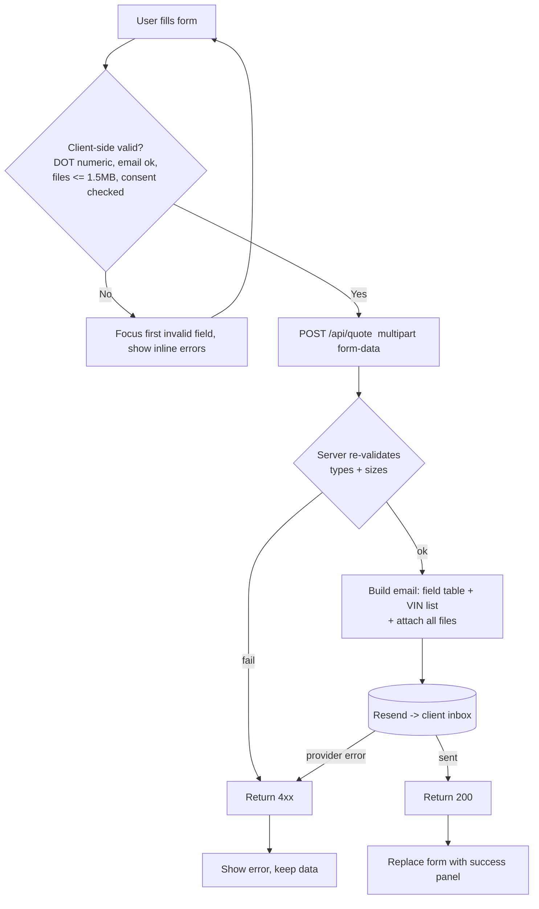

# Get a Quote Page — Layout & Content Reference (CUSTOM FORM)

Reference URL (structure only, **not** copied): https://reliancepartners.com/quote/

> The reference site uses a 3-tab wizard (Basic Info → Coverage → Equipment) with dozens of
> fields and repeatable driver/tractor/trailer rows. **We are NOT copying that.** The client
> wants **one single customized quote form** with the specific fields below. Requirements
> source: `REQUIREMENTS.md` (authoritative) reconciled with `Website_Development_Proposal.docx`.

## 1. Page overview

A single page with one form. The visitor fills it out; on submit, **all field values plus all
uploaded documents are emailed directly to the client's inbox** via Resend. No admin panel,
no database, no customer auto-reply (client replies manually). No multi-step wizard — one
scrollable form grouped into labelled sections, with a single Submit at the bottom.

Form has **6 field groups** + submit.

## 2. Complete section-by-section breakdown

| # | Section | Purpose |
|---|---------|---------|
| 0 | Header / nav | Global |
| 1 | Intro / hero | Short title + one line on what happens next + phone |
| 2 | **Form group A — Company & Contact** | Who is asking |
| 3 | **Form group B — Vehicles (VINs)** | At least 5 VIN inputs |
| 4 | **Form group C — Coverages Needed** | Free-text description |
| 5 | **Form group D — Attachments** | Document uploads (incl. Excel vehicle list) |
| 6 | Consent + Submit | Disclaimer checkbox + submit button |
| 7 | Success / error state | Confirmation message after send |
| 8 | Footer | Global |

## 3. Content / text

### Section 1 — Intro
- **H1:** "Get a Quote"
- **Body:** "Fill out the form below and attach your documents. Our team will review your
  information and get back to you with a quote. All fields marked * are required."
- **Phone:** "Prefer to talk? Call [client phone]" (`tel:` link)

### Section 2 — Form group A: Company & Contact Information

| Field | Type | Required | Rules / notes |
|-------|------|----------|---------------|
| DOT Number | text input, **numbers only** | Yes | Reject non-digits: `inputmode="numeric"`, `pattern="[0-9]*"`, strip/block non-numeric on input; validate 1–8 digits |
| Company Name | text | Yes | |
| Garaging Address | text (or address group: street / city / state / zip) | Yes | Where vehicles are parked; single line acceptable per proposal |
| Company Owner Name | text | Yes | |
| Email | email | Yes | valid email format |
| Phone Number | tel | Yes | digits / formatting mask; validate 10+ digits |

### Section 3 — Form group B: Vehicle VIN Numbers

- **Label:** "Vehicle VIN Numbers"
- **Helper text:** "Enter the VIN for each vehicle. If you have more than 5 vehicles, fill in
  what you can and attach a full vehicle list as an Excel file below."
- **5 VIN text inputs shown by default** (`VIN 1` … `VIN 5`).
  - Each: text, optional (at least VIN 1 recommended required — confirm with client), max 17
    chars, uppercase transform, VIN charset `[A-HJ-NPR-Z0-9]` (no I/O/Q). Soft-validate
    length 17; warn but don't hard-block (older/foreign units vary).
- **"+ Add another vehicle"** button → appends more VIN inputs (no hard cap; if >5, nudge
  toward the Excel upload).

### Section 4 — Form group C: Coverages Needed

| Field | Type | Required | Notes |
|-------|------|----------|-------|
| Coverages Needed | textarea (5–6 rows) | Yes | "Describe the coverage you're looking for — e.g. auto liability, cargo, physical damage, limits, effective date." |

### Section 5 — Form group D: Attachments

- **Group label:** "Attachments"
- **Helper:** "Upload PDF, JPG, PNG, DOC/DOCX, XLS/XLSX. Max **1.5 MB per file**. You can
  select multiple files per row."
- One labelled upload control per document type:

| # | Upload row | Accept | Multiple |
|---|-----------|--------|----------|
| 1 | Driver CDLs | pdf, image | yes |
| 2 | Driver MVRs | pdf, image | yes |
| 3 | Owner CDL | pdf, image | yes (usually 1) |
| 4 | Owner MVR | pdf, image | yes (usually 1) |
| 5 | IFTAs — last 4 quarters | pdf, image | yes (up to 4) |
| 6 | Loss Runs — prior years | pdf, image | yes |
| 7 | Vehicle list (Excel) — required only if more than 5 vehicles | .xls, .xlsx, .csv | no |

- Per-file validation: reject > 1.5 MB with inline message; show selected file name(s) + size +
  a remove (×) control; reject disallowed extensions.
- **Total payload guard:** warn if combined attachments approach the email provider limit
  (Resend ~40 MB/message incl. encoding overhead). If over, instruct user to send fewer/
  smaller files or the team will follow up for the rest.

### Section 6 — Consent + Submit

- **Consent checkbox (required):** "By submitting this form, you agree to receive text
  messages and email from [Company] related to your insurance quote and other relevant
  information. Message and data rates may apply. Reply STOP to unsubscribe or HELP for help.
  Your consent is not a condition of purchase. See our Privacy Policy."
- **Submit button:** `Submit Quote Request`
- Optional anti-spam: honeypot field + timestamp check, or hCaptcha/Turnstile.

### Section 7 — Success / error state
- **Success:** replace form with "✓ Thanks, [name]. Your quote request and documents have
  been sent to our team. We'll be in touch at [email] / [phone] shortly."
- **Error:** keep form data, show "Something went wrong sending your request. Please try
  again, or email us directly at [client email]."

## 4. Layout structure

- Single column, form max width ~720–800px, centered.
- Intro band full width above the form.
- Form sections stacked, each with a section heading + hairline divider.
- Within a section: 1 column on mobile; 2 columns on desktop for short paired fields
  (Email | Phone), full width for textarea, address, and upload rows.
- VIN inputs: 2-up grid on desktop, 1-up mobile; "Add another vehicle" below them.
- Attachment rows: full-width, label above control, selected-files list below control.
- Consent checkbox + Submit pinned at the end, Submit is full-width on mobile.
- Sticky mini "Submit" or progress hint optional on long mobile scroll (nice-to-have).

## 5. Component breakdown

- `SiteHeader`, `SiteFooter` (global)
- `QuoteFormPage` (client component / form island)
  - `FormSection` (title, children)
  - `TextField` (label, name, required, inputMode, pattern, validate)
  - `NumericField` — DOT Number (blocks non-digits)
  - `EmailField`, `PhoneField`
  - `TextAreaField` — Coverages Needed
  - `VinRepeater` → `VinInput` (index, value, onChange) + `AddVehicleButton`
  - `FileUploadRow` (label, accept, multiple, maxSizeMB=1.5, files[], onAdd, onRemove)
  - `ConsentCheckbox` (required)
  - `SubmitButton` (loading state)
  - `FormResult` (success | error)
- **Server:** `POST /api/quote` route handler → validate → assemble email (HTML table of
  fields + VIN list) → attach files → `resend.emails.send({ to: CLIENT_INBOX, attachments })`
  → return JSON. Enforce size/type server-side too (never trust client).

## 6. Visual hierarchy

1. H1 "Get a Quote".
2. Submit button — solid brand colour, largest interactive element, bottom.
3. Section headings (Company & Contact / Vehicles / Coverages Needed / Attachments).
4. Field labels — medium weight, always visible (not placeholder-only).
5. Helper text + validation messages — small; errors in red with icon.
6. Consent text — small print but legible (≥13px), checkbox clearly required.

## 7. CTA / button details

| Location | Label | Style | Action |
|----------|-------|-------|--------|
| Header | Get a Quote | Solid brand button | (current page / scroll to form) |
| Intro | [client phone] | `tel:` link | dial |
| VIN group | + Add another vehicle | Outline / text button | append VIN input |
| Each upload row | Choose files | File input / outline button | open file picker |
| Selected file | × Remove | Icon button | drop that file |
| End of form | Submit Quote Request | Solid brand button, full-width mobile | validate → POST → email |
| Error state | Try again | Solid button | re-POST |

## 8. Image / media requirements

- No decorative imagery required (utility page). Optional small hero/banner image or brand
  colour band behind the H1.
- Icons: upload icon per file row, checkmark for success, alert icon for errors, trash/×
  for remove. Line style, single colour.

## 9. User interactions

- **DOT Number:** keystrokes that aren't digits are blocked; paste is sanitised to digits.
- **Inline validation:** on blur for each field; on submit, scroll to and focus the first
  invalid field; disable Submit while sending and show spinner + "Sending…".
- **VIN repeater:** "Add another vehicle" adds a row; each added row has a × to remove
  (can't remove below 5 visible? — or allow, min 1). Live count; if count > 5, show a
  highlighted note: "You have more than 5 vehicles — please attach your Excel vehicle list."
- **File uploads:** select → validate size/type → list chips with name + KB/MB + ×. Drag-and
  -drop onto the row is a nice-to-have. Rejected files show why.
- **Submit success:** form is replaced by the success panel; no page reload; optionally
  push a `#thank-you` hash. Analytics event `quote_submitted` (if analytics used).
- **Submit failure:** form stays populated; error banner at top of form.
- **Keyboard/AX:** every input has a `<label for>`; error messages linked via
  `aria-describedby`; `aria-invalid` on bad fields; consent checkbox `required`; focus
  visible throughout.

## 10. Page layout diagram

### ASCII wireframe

```
┌───────────────────────────────────────────────────────────────┐
│ [LOGO]        Our Difference  Services  Contact  [GET A QUOTE] │  Header
├───────────────────────────────────────────────────────────────┤
│  H1: Get a Quote                                              │  1 INTRO
│  Fill out the form and attach your documents. * = required.   │
│  Prefer to talk? Call [client phone]                          │
├───────────────────────────────────────────────────────────────┤
│  ── Company & Contact Information ─────────────────────────    │  2 GROUP A
│  DOT Number* [123456____] (numbers only)                      │
│  Company Name* [__________________________]                   │
│  Garaging Address* [______________________]                   │
│  Company Owner Name* [____________________]                   │
│  Email* [________________]   Phone Number* [_____________]    │
│                                                              │
│  ── Vehicle VIN Numbers ──────────────────────────────────    │  3 GROUP B
│  VIN 1 [_________________]   VIN 2 [_________________]         │
│  VIN 3 [_________________]   VIN 4 [_________________]         │
│  VIN 5 [_________________]                                    │
│  [ + Add another vehicle ]                                    │
│  (>5 vehicles? attach the Excel list below)                   │
│                                                              │
│  ── Coverages Needed ─────────────────────────────────────    │  4 GROUP C
│  [ textarea: describe the coverage you need … ]               │
│  [                                              ]             │
│                                                              │
│  ── Attachments  (max 1.5 MB per file) ─────────────────────    │  5 GROUP D
│  Driver CDLs            [ Choose files ]  file1.pdf ×         │
│  Driver MVRs            [ Choose files ]                      │
│  Owner CDL              [ Choose files ]                      │
│  Owner MVR              [ Choose files ]                      │
│  IFTAs (last 4 qtrs)    [ Choose files ]                      │
│  Loss Runs (prior yrs)  [ Choose files ]                      │
│  Vehicle list (Excel, if >5 vehicles) [ Choose file ]        │
│                                                              │
│  ── ───────────────────────────────────────────────────      │  6 CONSENT + SUBMIT
│  [x] I agree to be contacted … (consent text)                │
│              [   Submit Quote Request   ]                    │
├───────────────────────────────────────────────────────────────┤
│  (after submit) ✓ Thanks — your request + docs were sent.    │  7 SUCCESS STATE
├───────────────────────────────────────────────────────────────┤
│  FOOTER                                                       │
└───────────────────────────────────────────────────────────────┘
```

### Mermaid — form structure

```mermaid
flowchart TD
    H[Header] --> INTRO[1. Intro: H1 + what happens next + phone]
    INTRO --> A[2. Group A: Company & Contact\nDOT#(numeric), Company, Garaging Address,\nOwner Name, Email, Phone]
    A --> B[3. Group B: Vehicle VINs\n5 inputs + Add another vehicle]
    B --> C[4. Group C: Coverages Needed textarea]
    C --> D[5. Group D: Attachments\nCDLs, MVRs, Owner CDL/MVR, IFTAs x4,\nLoss Runs, Excel vehicle list if >5]
    D --> E[6. Consent checkbox + Submit]
    E --> F[Footer]
```

### Mermaid — submit / user flow



## 11. Implementation notes

- **Email is the only "backend".** Fields → HTML table in the email body; VINs → ordered
  list; files → real email attachments. Recipient = client inbox (env var
  `QUOTE_INBOX`). Set a clear subject: `New Quote Request — {Company Name} (DOT {DOT#})`.
  Set `reply_to` to the submitter's email so the client can reply directly.
- **No customer auto-reply** (per proposal). Optional: a plain "we received your request"
  auto-reply is a cheap trust win — flag to client, don't build unless asked.
- **1.5 MB/file cap** (client confirmed every document is under this). Enforce on client AND server. Total message:
  keep under ~35–40 MB; if exceeded, reject with guidance (client rep will collect the rest —
  matches how the reference site handles IFTAs/Loss Runs).
- **DOT "numbers only"** is an explicit requirement — implement as input filtering + pattern,
  not just a post-submit regex.
- **VIN fields: 5 minimum visible**, expandable. Don't hard-require all 5 (small operators
  may have fewer) — confirm the required minimum with the client.
- **Excel vehicle list** upload is required *conditionally* (>5 vehicles). Simplest: always
  show it, label it "(if you have more than 5 vehicles)", and make it required only when the
  VIN row count exceeds 5.
- Spam protection: honeypot + Turnstile/hCaptcha recommended since this is a public form
  that triggers email.
- Accept attribute strings:
  - docs/images: `application/pdf,image/png,image/jpeg`
  - excel: `.xls,.xlsx,text/csv,application/vnd.openxmlformats-officedocument.spreadsheetml.sheet`
- Store nothing server-side unless the client later asks for a copy/log (proposal says no
  admin panel / no DB). If a log is wanted, cheapest is BCC the client or a shared inbox.
- Keep field names identical to the home page's short inline form where they overlap
  (Name/Owner Name, Email, Phone, Address/Garaging Address).
