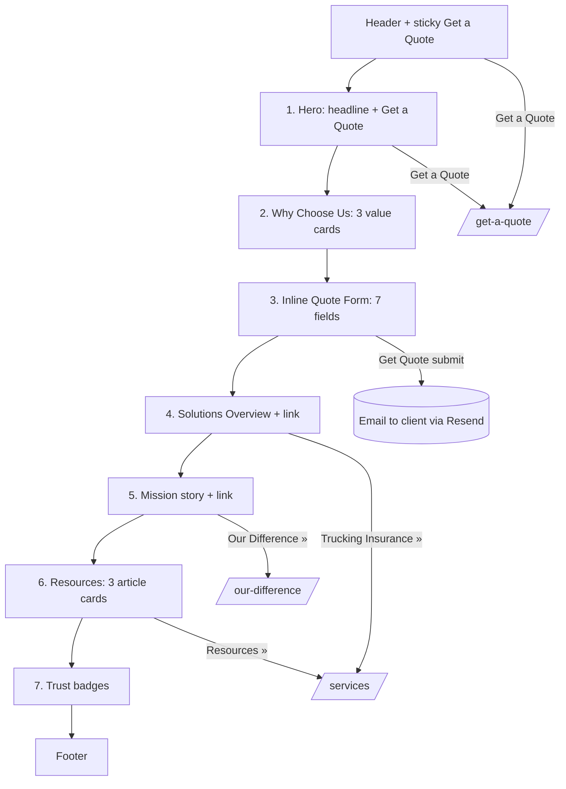

# Home Page — Layout & Content Reference

Reference URL: https://reliancepartners.com/

## 1. Page overview

Marketing landing page for a trucking / freight insurance brokerage. Its job: state who the
company serves, why to choose them, capture a quote lead inline, and route visitors to the
Services, Our Difference, and Contact pages. One long single-column scroll, full-width
alternating background bands, one primary conversion goal (**Get a Quote**).

The reference home page has **7 content sections** between header and footer.

## 2. Complete section-by-section breakdown

| # | Section | Purpose |
|---|---------|---------|
| 0 | Header / nav | Persistent navigation + primary CTA |
| 1 | Hero | Headline promise + Get a Quote CTA |
| 2 | Why Choose Us | 3-column value proposition |
| 3 | Inline Quote Form | Lead capture without leaving the page |
| 4 | Solutions Overview | Short pitch + link into Services |
| 5 | Company Mission | Brand story, founding, link to Our Difference |
| 6 | Resources / News | 3 latest article cards (**optional for clone** — see notes) |
| 7 | Trust / Credentials | Award & certification badge strip |
| 8 | Footer | Global footer |

## 3. Content / text (verbatim from reference — reword for client)

### Section 1 — Hero
- **H1:** "Trucking Insurance From the Freight Specialists"
- **Sub:** "Focus on your destination. Let us watch your back."
- **Button:** `Get A Quote` → `/get-a-quote/`

### Section 2 — Why Choose Us
- **Section heading:** "Why Choose Reliance Partners?"
- **Card 1 — "We Speak Your Language":** "Whether it's Spanish or Bosnian. Operating ratios or CSA scores. We get it. We understand the importance of effective communication including defense costs and legal liability. Our diverse team of experts works closely with you to ensure that you make the best decisions to protect your business. We understand the road you're on — and we want to ride along."
- **Card 2 — "We Build Your Perfect Strategy":** "We start by listening. By leveraging our extensive network of insurance companies, we create a customized strategy that aligns with your goals and priorities. Whether you are a small operation with a single truck or a large enterprise with a fleet of a thousand units, we have you covered. We specialize in providing API-driven, customized coverage on demand to meet the specific requirements of your business."
- **Card 3 — "We Go The Extra Mile":** "There are no corner offices at Reliance Partners. We offer guidance on industry changes, help you file claims, and assist in fixing any incorrect violations. We understand the importance of efficiency, which is why we provide fast and direct online access to certificates of insurance. Our commitment is to serve you promptly and effectively to service your insurance needs."

### Section 3 — Inline Quote Form
- **Heading:** "Get A Quote"
- **Phone CTA:** "877.668.1704" (replace with client phone)
- **Fields:** Name*, Email*, Phone*, Address*, State (dropdown — US states/territories), Language (dropdown: English, Español, Russian), Comments/Questions* (textarea)
- **Disclaimer:** "By submitting this form, you agree to receive text messages from [Company] related to insurance products, insurance quotes, and other relevant information. Message and data rates may apply. Message frequency may vary. You can reply STOP to unsubscribe at any time or HELP for help. Your consent is not a condition of purchase. For more details, please review our Privacy Policy."
- **Button:** `Get Quote`

### Section 4 — Solutions Overview
- **Heading:** "Insurance Solutions That Match Your Needs"
- **Body:** "Our dedicated team starts by matching you with a knowledgeable account manager who understands the intricacies of logistics insurance. We offer insurance solutions that protect your business and its assets, including truck, warehousing, and freight broker insurance. Whether you operate within the United States or require coverage in Canada and Mexico, our specialty NAFTA trucking programs have you covered. If you need a customized insurance solution, our API-driven coverage on demand can be tailored to meet your specific needs."
- **Link:** `Trucking Insurance »` → `/services/`

### Section 5 — Company Mission
- **Heading:** "Let's Achieve Success Together"
- **Body:** "At Reliance Partners, we're out to revolutionize an old industry. Our founders launched our company in 2009 to bring clarity, transparency and new energy to the intersection of transportation and insurance. We come from the world of trucking, freight and logistics, and we understand you work in a fast-paced environment that requires nimble partners. Our unwavering dedication to providing the highest-quality customer service sets us apart in the industry. Trust Reliance Partners to support your business's success by delivering comprehensive insurance servicing that matches your unique requirements."
- **Link:** `Our Difference »` → `/our-difference/`

### Section 6 — Resources / News
- **Section link:** `Resources »` → `/services/` (or a news index if built)
- **3 cards**, each = date + headline + link. Reference examples:
  - Aug 11, 2026 — "Reliance Partners Earns 10th Inc. 5000 Recognition"
  - Aug 5, 2026 — "Fifth Annual Trucking Matters Seminar Series 2026 Recap"
  - Jul 17, 2026 — "Reliance Partners Expands Executive Leadership Team with Three Key Promotions"

### Section 7 — Trust / Credentials
- **Heading:** "Trusted Partners. Trusted Advisors."
- Row of 5–6 award / certification badge images.

## 4. Layout structure

- Single column, max content width ~1200px, centered, generous vertical padding (~80–96px per band).
- Full-bleed background colour alternates band to band (white / light grey / brand-dark).
- **Hero:** full-viewport-width, ~70–85vh, background image or solid brand colour, text block left or centre, single button beneath sub-headline.
- **Why Choose Us:** 3 equal columns (desktop) → stacked (mobile <768px). Each column: icon, H3, paragraph.
- **Quote form:** two-column band — left = heading + phone + short reassurance text, right = form card on contrasting background. Stacks on mobile (text above form).
- **Solutions Overview & Mission:** each a 2-column split (text one side, image/graphic the other), alternating sides. Stacks on mobile.
- **Resources:** 3-up card grid → 1-up on mobile.
- **Trust badges:** single horizontal flex row, wraps on mobile, greyscale logos.

## 5. Component breakdown

- `SiteHeader` (logo, NavLinks[4], ButtonLink "Get a Quote", MobileMenuToggle)
- `Hero` (bgImage, h1, subtitle, primaryCta)
- `SectionHeading` (eyebrow?, h2, optional intro)
- `ValueCard` ×3 (icon, title, body)
- `QuoteFormInline` (see `get-a-quote.md` §Components; this is the SHORT variant — 7 fields)
- `SplitFeature` (heading, body, linkArrow, media, imageSide: left|right)
- `ArticleCard` ×3 (date, title, href)
- `BadgeStrip` (images[])
- `SiteFooter` (logo, blurb, navLinks, contactBlock, socialIcons, legalLinks, copyright, disclaimer)

## 6. Visual hierarchy

1. Hero H1 — largest type on the page (~48–64px desktop), highest contrast.
2. Hero CTA button — primary brand colour, only solid button above the fold.
3. Section H2s — ~32–40px, consistent style, often centered.
4. Value card H3s / split-feature headings — ~22–28px.
5. Body copy — ~16–18px, ~65ch measure, muted colour.
6. Trust badges — smallest, greyscale, lowest emphasis (reassurance, not attention).
- Colour used to separate bands and to make the two CTAs (hero button, form submit) pop.

## 7. CTA / button details

| Location | Label | Style | Target |
|----------|-------|-------|--------|
| Header | Get a Quote | Solid brand button | `/get-a-quote/` |
| Hero | Get A Quote | Solid brand button, large | `/get-a-quote/` |
| Quote form band | Get Quote | Solid submit button | POST → email via Resend |
| Solutions Overview | Trucking Insurance » | Text link w/ arrow | `/services/` |
| Mission | Our Difference » | Text link w/ arrow | `/our-difference/` |
| Resources | Resources » | Text link w/ arrow | `/services/` or news index |
| Header phone / form | 877.668.1704 | `tel:` link | dial |

## 8. Image / media requirements

- Hero background: wide truck / freight / highway photograph, dark enough for white text overlay (or brand-colour block + cutout image). ~2400×1400.
- 3 value-prop icons (line style, single colour) — communication, strategy/plan, extra-mile/road.
- Solutions Overview image: account manager / logistics scene, ~1000×800.
- Mission image: team or founding story photo, ~1000×800.
- 3 article thumbnails (optional if news section kept), ~600×400 each.
- 5–6 award/certification badge PNGs with transparency, ~200×200.
- Logo: colour (header) + mono/white (footer + on dark hero).

## 9. User interactions

- Sticky header; may shrink / add shadow on scroll.
- Mobile hamburger toggles full menu; body scroll-locked while open.
- Value cards / split features may fade/slide in on scroll (optional).
- Inline quote form: client-side required-field validation, phone/email format checks,
  numeric-only where relevant; on submit → spinner → success message ("Thanks, we'll be in
  touch") or inline error; sends email (fields only, no attachments in this short form) via Resend.
- Badge strip may auto-scroll/marquee (optional; static row is fine).
- All `tel:` links dial on mobile.

## 10. Page layout diagram

### ASCII wireframe

```
┌───────────────────────────────────────────────────────────────┐
│ [LOGO]              Our Difference  Services  Contact  [GET A QUOTE] │  Header (sticky)
├───────────────────────────────────────────────────────────────┤
│                                                               │
│              H1: Trucking Insurance From the                  │
│                    Freight Specialists                        │  1 HERO
│         Sub: Focus on your destination...                     │  (full-bleed image)
│                  [  Get A Quote  ]                            │
│                                                               │
├───────────────────────────────────────────────────────────────┤
│                 H2: Why Choose [Company]?                     │
│  ┌──────────────┐  ┌──────────────┐  ┌──────────────┐         │  2 WHY CHOOSE US
│  │ (icon)       │  │ (icon)       │  │ (icon)       │         │  3 columns
│  │ Speak Your   │  │ Build Your   │  │ Go The       │         │
│  │ Language     │  │ Strategy     │  │ Extra Mile   │         │
│  │ paragraph…   │  │ paragraph…   │  │ paragraph…   │         │
│  └──────────────┘  └──────────────┘  └──────────────┘         │
├───────────────────────────────────────────────────────────────┤
│  H2: Get A Quote            │  ┌─────────────────────────────┐ │
│  ☎ 877.668.1704            │  │ Name  [_______]             │ │  3 INLINE QUOTE FORM
│  Short reassurance copy     │  │ Email [_______]  Phone[___] │ │  (2-col band)
│                             │  │ Address[______]  State[▼]   │ │
│                             │  │ Language[▼]                 │ │
│                             │  │ Comments [____________]     │ │
│                             │  │ disclaimer text             │ │
│                             │  │        [  Get Quote  ]      │ │
│                             │  └─────────────────────────────┘ │
├───────────────────────────────────────────────────────────────┤
│  ┌───────────────┐   H2: Insurance Solutions That Match       │  4 SOLUTIONS OVERVIEW
│  │   image        │   Your Needs                              │  (split, image left)
│  │                │   body paragraph…                         │
│  └───────────────┘   Trucking Insurance »                     │
├───────────────────────────────────────────────────────────────┤
│  H2: Let's Achieve Success Together     ┌───────────────┐     │  5 MISSION
│  body paragraph…                        │    image       │     │  (split, image right)
│  Our Difference »                       └───────────────┘     │
├───────────────────────────────────────────────────────────────┤
│  Resources »                                                  │
│  ┌────────────┐  ┌────────────┐  ┌────────────┐               │  6 RESOURCES/NEWS
│  │ date       │  │ date       │  │ date       │               │  (optional)
│  │ headline   │  │ headline   │  │ headline   │               │
│  └────────────┘  └────────────┘  └────────────┘               │
├───────────────────────────────────────────────────────────────┤
│           H2: Trusted Partners. Trusted Advisors.             │  7 TRUST BADGES
│   [badge] [badge] [badge] [badge] [badge] [badge]            │
├───────────────────────────────────────────────────────────────┤
│  [LOGO]  blurb   | Nav | Contact ☎ ✉ 📍 | 🔗🔗🔗🔗            │  FOOTER
│  © 2026 [Company].  Terms · Privacy · disclaimer              │
└───────────────────────────────────────────────────────────────┘
```

### Mermaid — page flow & conversion paths



## 11. Implementation notes

- **Two quote entry points, different depth:** the home inline form is the SHORT 7-field
  version (lead only, no uploads). The dedicated `/get-a-quote/` page is the full custom
  form with VINs + attachments. Both email the client via Resend. Keep field names
  consistent between them.
- **Section 6 (Resources/News) is optional** for the clone — client has no blog in the
  proposal. Either drop it, or repurpose as a static "Services at a glance" 3-card block
  linking into `/services/`. Decide with client.
- Reword all verbatim Reliance copy for Divine Group Inc's actual business and remove
  claims the client can't substantiate (awards, "since 2009", "270+ carriers", etc.).
- Language dropdown (English/Español/Russian) — keep only if client actually offers
  multilingual service; otherwise remove.
- Keep the page to one primary CTA (Get a Quote). Don't add competing buttons.
- Build order suggestion: Header/Footer → Hero → Why Choose Us → Inline form → split
  features → badges. News last / optional.
- Accessibility: single H1 (hero), logical H2 per section, labelled form inputs, visible
  focus states, alt text on all badges/images, colour-contrast AA on hero overlay text.
