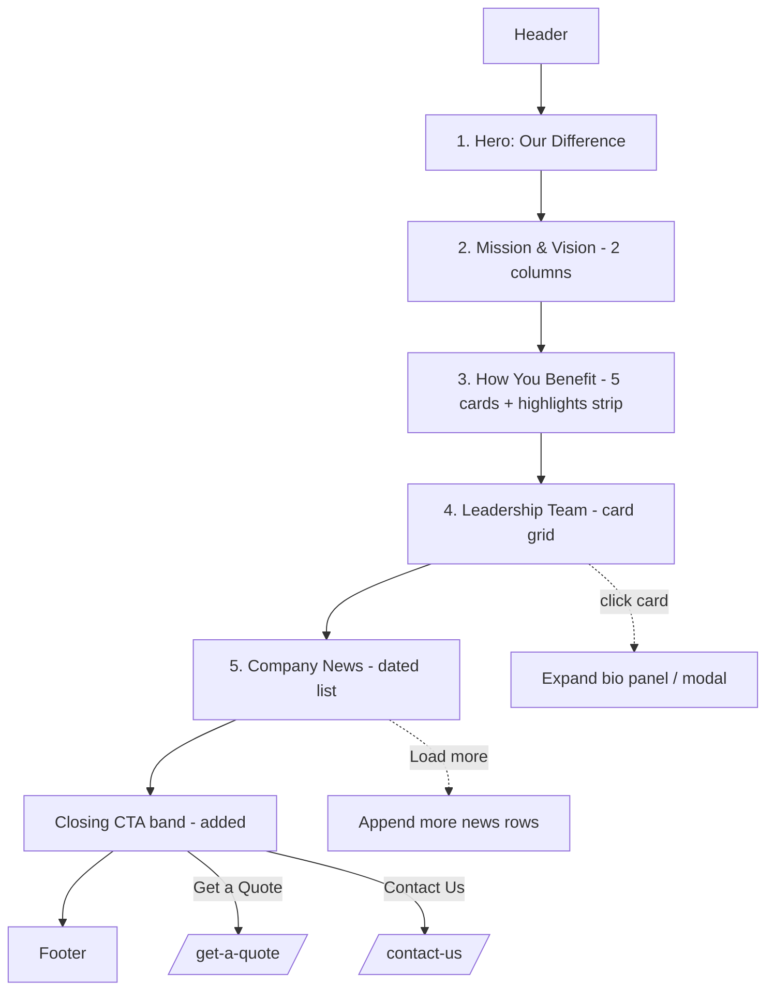

# Our Difference Page — Layout & Content Reference

Reference URL: https://reliancepartners.com/about/

## 1. Page overview

The "about / why us" page. Establishes credibility: mission & vision, concrete benefits of
working with the company, the leadership team, and a running list of company news/milestones.
Single-column scroll with clearly labelled subsections. For the clone this is trimmed — the
reference page's 15-person leadership grid and 50+ news archive are heavier than the client needs.

Reference page has **5 content sections** (+ header/footer).

## 2. Complete section-by-section breakdown

| # | Section | Purpose |
|---|---------|---------|
| 0 | Header / nav | Global |
| 1 | Hero | Page title + positioning statement |
| 2 | Mission & Vision | Two statements, side by side |
| 3 | How You Benefit | 5 benefit cards + a stats/highlights strip |
| 4 | Leadership Team | Grid of people with expandable bios |
| 5 | Company News | Reverse-chronological milestone list |
| 6 | Footer | Global |

## 3. Content / text (verbatim from reference — reword for client)

### Section 1 — Hero
- **H1:** "Our Difference"
- **Body:** "Reliance Partners was built by people who understand the trucking and freight broker industries. We know how to match the right insurance strategy with your business goals. We're driven to help you succeed."

### Section 2 — Mission & Vision
- **Eyebrow / heading:** "Mission & Vision"
- **Mission:** "Our mission is to provide superior risk management solutions powered by innovative technology and delivered through best-in-class customer service. Our customer-centric focus and 'Extra Mile' mentality must bring value to our clients beyond the standard scope of insurance."
- **Vision:** "Our vision is to become the leader in the trucking and logistics insurance marketplace by applying technology and innovation that challenge the status quo. This will be accomplished through a highly-motivated, diverse team of individuals focused around collaboration, innovation, and transparency. Forward, progressive thinking will differentiate Reliance Partners."

### Section 3 — How You Benefit
- **Heading:** "How You Benefit"
- **Benefit cards (5):**
  1. **Transportation & Logistics Expertise** — "Accelerate your growth by leveraging our extensive industry knowledge about the trends that will affect your business."
  2. **Risk Management Foresight** — "Improve the safety and compliance programs key to your company's success with our suite of risk management services and safety seminars."
  3. **Professional Resources** — "Boost your bottom line with resources geared to have a positive impact on your CSA scores and reduced premiums."
  4. **Preferred Underwriting Status** — "Leverage our extensive network and superior relationships with underwriters across the country. Get custom solutions and preferred access."
  5. **Best-in-Class Customer Service** — "Stay in control with support from our team. We will help you with reducing overall risk, loss forecasting and claims management."
- **Highlights / stats strip (3):**
  - "24/7 Access to Policy & Certificates of Insurance"
  - "270+ Insurance Companies Networked"
  - "25 Languages Spoken by Our Staff"

### Section 4 — Leadership Team
- **Heading:** "Our Leadership Team"
- **Description:** "Driving Reliance Partners to the forefront of the insurance industry."
- Reference lists 15 executives (Co-Founder & CEO, President, COO, CRO, CCO, CFO, CMO, EVP & GM, CSO, EVP International Logistics, EVP Finance, EVP Compliance & Claims, VP Enterprise, EVP Logistics Services, SVP Operations). Each card: photo, name, title, click → expandable bio.
- **Bio card structure (per person):** headshot, name, title, bio paragraph(s), and an
  "Additional Details" block (e.g. Hometown, First Car, Dream Car, favourite quote).

### Section 5 — Company News
- **Heading:** "Company News"
- Reverse-chronological list; each row = date + linked headline. Reference has 50+ entries
  back to 2015 (awards, promotions, expansions, partnerships, community events).

## 4. Layout structure

- Single column, ~1200px max width, centered.
- **Hero:** full-bleed band, H1 + one paragraph, left or centre aligned, shorter than the home hero (~40–50vh).
- **Mission & Vision:** 2 equal columns (Mission | Vision) on desktop → stacked on mobile. Optional divider between.
- **How You Benefit:** 5-card grid — 3-up then 2-up on desktop, or a responsive auto-fit grid; → 1-up mobile. Highlights strip below as a 3-column inline row on a contrasting band.
- **Leadership:** responsive card grid, ~3–4 per row desktop, 2 tablet, 1 mobile. Clicking a card expands an accordion panel or opens a modal with the full bio.
- **Company News:** simple full-width vertical list, date left / headline right (or date above headline), rows separated by hairline rules; "load more" or pagination if long.

## 5. Component breakdown

- `SiteHeader`, `SiteFooter` (global)
- `Hero` (h1, body) — text-only variant
- `TwoColStatements` (left: {label, body}, right: {label, body})
- `BenefitCard` ×5 (icon, title, body)
- `HighlightStrip` (items[] — big number/phrase + caption)
- `PersonCard` (photo, name, title, onExpand)
- `PersonBioPanel` / `PersonBioModal` (photo, name, title, bodyRichText, detailsList[])
- `NewsList` → `NewsRow` (date, title, href)
- `Pagination` / `LoadMoreButton`

## 6. Visual hierarchy

1. Hero H1 "Our Difference" — largest.
2. Section H2s (Mission & Vision / How You Benefit / Our Leadership Team / Company News).
3. Highlights strip numbers ("270+", "24/7", "25") — visually loud, brand colour, second-loudest element after H1.
4. Benefit card + person names — H3 scale.
5. Body copy + bios — base size, muted.
6. News dates — small, muted; headlines — link colour, medium weight.

## 7. CTA / button details

The reference page has **no primary button** in the body (no hero CTA). For the clone, add a
closing CTA band before the footer:

| Location | Label | Style | Target |
|----------|-------|-------|--------|
| Header | Get a Quote | Solid brand button | `/get-a-quote/` |
| Person card | (expand) "Read bio" / whole card | Text / affordance | toggles bio panel |
| News row | headline | Text link | article (or external) |
| News section footer | "Load more" | Outline button | paginate |
| **Added closing band** | "Get a Quote" + "Contact Us" | Solid + outline | `/get-a-quote/`, `/contact-us/` |

## 8. Image / media requirements

- Optional hero background/side image: team or office, ~1600×900.
- 5 benefit icons (line style, one colour).
- Leadership headshots: consistent crop/size/background, ~600×600, square. (Clone: as many as client provides — even 2–4 is fine.)
- No imagery required for Mission/Vision or News (text lists).
- Optional: 3 small icons for the highlights strip.

## 9. User interactions

- Sticky header + mobile hamburger.
- **Leadership cards:** click / Enter toggles an expandable bio (accordion) or opens a modal;
  Esc closes modal; focus trapped in modal; only one accordion open at a time (optional).
- **Company News:** "Load more" appends rows, or numbered pagination; external links open in new tab with `rel="noopener"`.
- Scroll-reveal animation on benefit cards (optional).
- Mission/Vision may animate in as a pair.

## 10. Page layout diagram

### ASCII wireframe

```
┌───────────────────────────────────────────────────────────────┐
│ [LOGO]        Our Difference  Services  Contact  [GET A QUOTE] │  Header
├───────────────────────────────────────────────────────────────┤
│  H1: Our Difference                                           │  1 HERO (text)
│  Built by people who understand trucking & freight…           │
├───────────────────────────────────────────────────────────────┤
│  MISSION & VISION                                             │  2 MISSION & VISION
│  ┌───────────────────────┐   ┌───────────────────────┐        │  2 columns
│  │ Mission               │   │ Vision                │        │
│  │ Our mission is to…    │   │ Our vision is to…     │        │
│  └───────────────────────┘   └───────────────────────┘        │
├───────────────────────────────────────────────────────────────┤
│  H2: How You Benefit                                          │  3 HOW YOU BENEFIT
│  ┌────────┐ ┌────────┐ ┌────────┐                             │  5-card grid
│  │ Expert │ │ Risk   │ │ Prof.  │                             │
│  │ -ise   │ │ Mgmt   │ │ Res.   │                             │
│  └────────┘ └────────┘ └────────┘                             │
│  ┌────────┐ ┌────────┐                                        │
│  │ Pref.  │ │ Best-  │                                        │
│  │ U/W    │ │ in-cls │                                        │
│  └────────┘ └────────┘                                        │
│  ── highlights band ─────────────────────────────────────     │
│   24/7 access   |   270+ carriers   |   25 languages         │
├───────────────────────────────────────────────────────────────┤
│  H2: Our Leadership Team                                      │  4 LEADERSHIP
│  Driving [Company] to the forefront…                          │  card grid, click=bio
│  ┌────┐ ┌────┐ ┌────┐ ┌────┐                                  │
│  │ 📷 │ │ 📷 │ │ 📷 │ │ 📷 │   name / title                   │
│  └────┘ └────┘ └────┘ └────┘                                  │
│  ▼ (expanded bio panel: photo + paragraphs + details list)   │
├───────────────────────────────────────────────────────────────┤
│  H2: Company News                                             │  5 COMPANY NEWS
│  Aug 11, 2026  — Headline ……………………………………………               │  date + headline list
│  Aug 05, 2026  — Headline ……………………………………………               │
│  Jul 17, 2026  — Headline ……………………………………………               │
│                       [ Load more ]                          │
├───────────────────────────────────────────────────────────────┤
│  (added) Ready to work with us?  [Get a Quote] [Contact Us]  │  CLOSING CTA (new)
├───────────────────────────────────────────────────────────────┤
│  FOOTER                                                       │
└───────────────────────────────────────────────────────────────┘
```

### Mermaid — structure & interactions



## 11. Implementation notes

- **Trim for the clone:** 5 benefit cards is fine; leadership grid scales to whatever
  headshots the client supplies; Company News can be a short static list of 3–6 items or
  dropped entirely if the client has no news.
- Drop Reliance-specific unverifiable claims ("270+", "25 languages", "since 2009",
  CSA-score language) unless true for the client.
- Mission & Vision: keep as two short statements; don't pad.
- Leadership bios: the quirky "First Car / Dream Car" detail block is optional personality —
  include only if the client wants that tone.
- Add the closing CTA band (not in reference) so the page has a conversion exit.
- Accessibility: expandable bios must be keyboard-operable (`button`, `aria-expanded`), modal
  variant needs focus trap + Esc + return focus to trigger.
