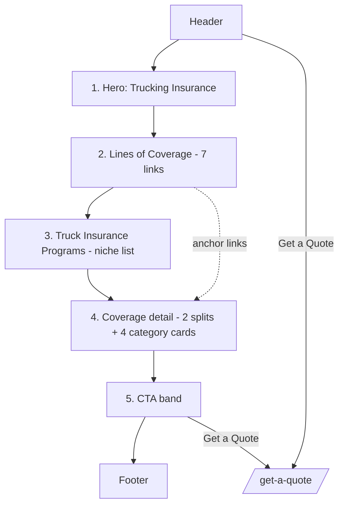

# Services → Trucking Insurance (sub-page) — Layout & Content Reference

Reference URL: https://reliancepartners.com/trucking-insurance/
Parent: `services.md`

## 1. Page overview

Deep-dive product page for the flagship service. Explains the company's advisory role,
lists the lines of coverage, describes niche programs, spells out what's covered and how
premiums/deductibles work, then pushes to Get a Quote. Single-column, heading-delimited
topic blocks.

Reference page has **5 content sections** (+ header/footer).

## 2. Complete section-by-section breakdown

| # | Section | Purpose |
|---|---------|---------|
| 0 | Header / nav | Global |
| 1 | Hero | Title + advisor positioning + intro paragraph |
| 2 | Lines of Coverage | Linked list of 7 coverage types |
| 3 | Truck Insurance Programs | Niche/vertical programs paragraph + list |
| 4 | Coverage & Benefits detail | "Total Coverage", "Cost-effective", and 4 category explainers |
| 5 | CTA band | "Get Your Truck Insurance Quote Now" |
| 6 | Footer | Global |

## 3. Content / text (verbatim / near-verbatim from reference — reword for client)

### Section 1 — Hero
- **H1:** "Trucking Insurance"
- **Subheading:** "Reliance Partners Is A True Advisor To Professionals In The Transportation Industry."
- **Body:** company's expertise with owner-operators and fleets; specialty programs across US states; NAFTA coverage options for Canada and Mexico.

### Section 2 — Lines of Trucking Insurance Coverage
- **Heading:** "Lines of Trucking Insurance Coverage"
- **7 items (each a link/anchor):**
  1. Auto Liability
  2. Motor Truck Cargo
  3. Physical Damage
  4. General Liability Insurance
  5. Excess or Umbrella Insurance
  6. Non-Trucking Liability & Bobtail Insurance
  7. Occupational Accident Coverage (OCC/ACC)

### Section 3 — Truck Insurance Programs
- **Heading:** "Truck Insurance Programs"
- **Body:** value-added benefits; customer-service recognition ("Inc.com, Fortune, and Business Insurance").
- **Niche programs listed:** new venture, high-risk, owner-operator, box trucks, bulk haulers, couriers, dump operations, haz-mat carriers, hot-shots, LTL companies, tow truck operations, warehouse operations.

### Section 4 — Coverage & Benefits detail
- **"We Provide Total Coverage":** comprehensive protection including fire and theft, physical damage repairs, gap coverage, towing, driver personal effects, medical benefits, non-trucking liability, and pollution buyback coverage.
- **"Our cost-effective policies":** affordability and tailored coverage so clients aren't "insurance rich and cash poor."
- **"Categories of comprehensive trucking insurance covers that we offer":**
  1. **Basic Coverage** — combines liability and collision; covers damage to other vehicles and your own; liability covers non-collision damage.
  2. **Specialized Coverage** — for special deliveries; commercial auto liability, truck/cargo coverage, bodily injury protection, cargo-loss consideration.
  3. **Our Premiums** — monthly advance payments; cost depends on driving record.
  4. **Our Deductibles** — range $500–$2,000; example: "$1,500 accident with $1,000 deductible = company covers $500."

### Section 5 — CTA band
- **Heading:** "Get Your Truck Insurance Quote Now"
- **Button:** `Get a Quote` → `/get-a-quote/`

## 4. Layout structure

- Single column, ~1000–1200px, centered.
- **Hero:** full-bleed band; H1, subheading (smaller, one line), intro paragraph (~65ch).
- **Lines of Coverage:** 2-column bulleted link list on desktop → 1 column mobile. Optional
  each item becomes an anchor to a detail block lower down.
- **Truck Insurance Programs:** intro paragraph full width, then the niche-program list as a
  multi-column chip/tag list or 2–3 column bulleted list.
- **Coverage & Benefits detail:** alternating text/image `SplitFeature` rows for "Total
  Coverage" and "Cost-effective"; the 4 category explainers as a 2×2 card grid or a
  numbered accordion.
- **CTA band:** full-bleed brand background, centered heading + button.

## 5. Component breakdown

- `SiteHeader`, `SiteFooter` (global)
- `Hero` (h1, subtitle, body)
- `CoverageLinkList` → `CoverageLink` (label, anchor)
- `Prose` block (Truck Insurance Programs paragraph)
- `TagList` / `BulletColumns` (niche programs)
- `SplitFeature` ×2 (reused)
- `CategoryCard` ×4 (title, body) OR `Accordion` with 4 items
- `CtaBand` (heading, primaryCta) — reused from `services.md`

## 6. Visual hierarchy

1. Hero H1 "Trucking Insurance".
2. CTA band heading + button.
3. Section H2s.
4. Category explainer titles / SplitFeature headings (H3).
5. Coverage link list — link colour, medium weight.
6. Body copy and niche-program list — base, muted.

## 7. CTA / button details

| Location | Label | Style | Target |
|----------|-------|-------|--------|
| Header | Get a Quote | Solid brand button | `/get-a-quote/` |
| Coverage link list | Auto Liability, etc. | Text links | anchor `#auto-liability` … (or future pages) |
| CTA band | Get a Quote | Solid brand button, large | `/get-a-quote/` |

## 8. Image / media requirements

- Hero background: truck on highway / fleet yard, ~2400×1200, dark enough for overlay text.
- 2 photos for the SplitFeature rows (repair shop / paperwork-with-agent), ~1000×800.
- Optional small icons for the 4 category cards.
- No per-coverage-line images required.

## 9. User interactions

- Sticky header + mobile hamburger.
- Coverage links smooth-scroll to anchors (if detail blocks exist) or navigate to sub-pages.
- Category explainers, if built as accordion: click/Enter toggles, `aria-expanded`.
- CTA button → Get a Quote.
- `tel:` link in footer dials on mobile.

## 10. Page layout diagram

### ASCII wireframe

```
┌───────────────────────────────────────────────────────────────┐
│ [LOGO]        Our Difference  Services  Contact  [GET A QUOTE] │  Header
├───────────────────────────────────────────────────────────────┤
│  H1: Trucking Insurance                                       │  1 HERO
│  Sub: A true advisor to professionals in transportation.      │
│  Intro paragraph about owner-operators, fleets, NAFTA…        │
├───────────────────────────────────────────────────────────────┤
│  H2: Lines of Trucking Insurance Coverage                     │  2 LINES OF COVERAGE
│  • Auto Liability            • Excess or Umbrella             │  2-col link list
│  • Motor Truck Cargo         • Non-Trucking Liability/Bobtail │
│  • Physical Damage           • Occupational Accident (OCC/ACC)│
│  • General Liability                                          │
├───────────────────────────────────────────────────────────────┤
│  H2: Truck Insurance Programs                                 │  3 PROGRAMS
│  paragraph about value-added benefits & recognition…          │
│  [new venture][high-risk][owner-op][box truck][bulk haul]     │  tag/bullet list
│  [courier][dump][haz-mat][hot-shot][LTL][tow][warehouse]      │
├───────────────────────────────────────────────────────────────┤
│  ── split: "We Provide Total Coverage"   [text | image] ──    │  4 COVERAGE DETAIL
│  ── split: "Our cost-effective policies" [image | text] ──    │
│  ┌───────────┐ ┌───────────┐                                  │
│  │ Basic     │ │ Specialized│                                 │  2×2 category grid
│  │ Coverage  │ │ Coverage   │                                 │
│  └───────────┘ └───────────┘                                  │
│  ┌───────────┐ ┌───────────┐                                  │
│  │ Premiums  │ │ Deductibles│                                 │
│  └───────────┘ └───────────┘                                  │
├───────────────────────────────────────────────────────────────┤
│      H2: Get Your Truck Insurance Quote Now  [ Get a Quote ]  │  5 CTA BAND
├───────────────────────────────────────────────────────────────┤
│  FOOTER                                                       │
└───────────────────────────────────────────────────────────────┘
```

### Mermaid



## 11. Implementation notes

- This sub-page is **optional for phase 1** — its content can live as an expanded card /
  accordion section on `services.md` until the client wants a dedicated page.
- Strip unverifiable brand claims (publication recognition, specific program names the
  client doesn't run).
- Dollar figures for premiums/deductibles are illustrative from the reference — replace with
  the client's real numbers or make them clearly "example only".
- Reuse `SplitFeature` and `CtaBand`; do not create new components.
- If coverage links go to anchors, ensure each has a matching detail block; otherwise make
  them plain text (not links) to avoid dead links.
