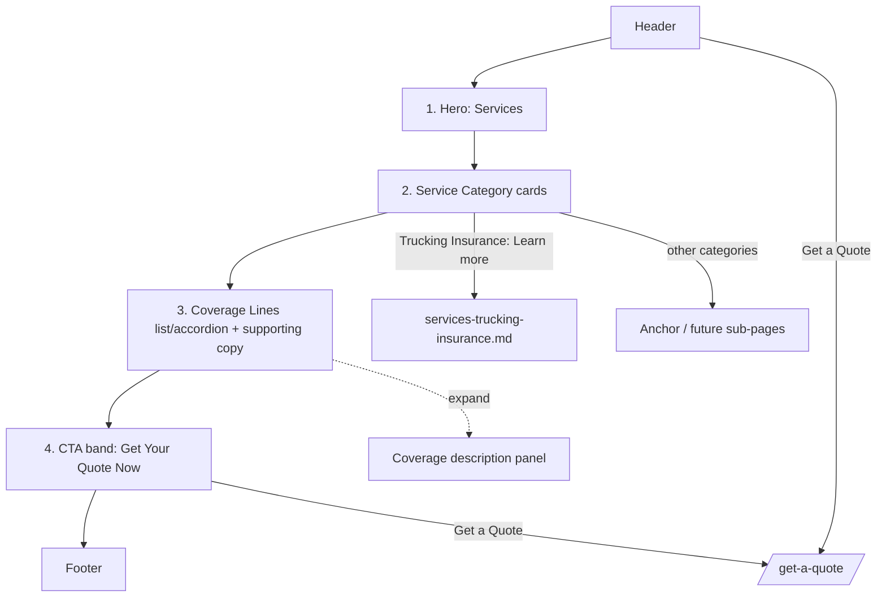

# Services Page — Layout & Content Reference

Reference: the **"Resources"** nav slot on https://reliancepartners.com/ is **renamed
"Services"** for the clone. Reliance's `/resources/` page is only a blog archive, which the
client does not want. Instead, the Services page is modelled on Reliance's product pages —
primarily **https://reliancepartners.com/trucking-insurance/** (documented in detail in
`services-trucking-insurance.md`) plus the Solutions mega-menu taxonomy.

## 1. Page overview

An overview page for what the company sells. It groups the offerings into a few service
categories, each with a short description and (optionally) a link to a deeper sub-page.
Ends with a strong Get a Quote CTA. Single-column scroll.

Proposed structure: **4 content sections** (+ header/footer).

## 2. Complete section-by-section breakdown

| # | Section | Purpose |
|---|---------|---------|
| 0 | Header / nav | Global |
| 1 | Hero | Page title + one-line positioning |
| 2 | Service Categories | Grid of service cards (the core of the page) |
| 3 | Coverage Lines / Details | Expandable or listed coverage types with descriptions |
| 4 | CTA band | "Get Your Quote Now" |
| 5 | Footer | Global |

## 3. Content / text

### Section 1 — Hero
- **H1:** "Services" (or "Insurance Solutions")
- **Sub (from reference):** "[Company] Is A True Advisor To Professionals In The Transportation Industry."
- **Body (from reference):** company's expertise with owner-operators and fleets, specialty programs across US states, and NAFTA (US/Canada/Mexico) coverage options.

### Section 2 — Service Categories
Cards derived from Reliance's Solutions menu. For the clone, pick the ones the client
actually offers. Each card = icon + title + 1–2 sentence description + optional "Learn more »".

| Card | Description seed |
|------|-----------------|
| **Trucking Insurance** | Coverage for owner-operators and fleets — auto liability, physical damage, motor truck cargo, and more. Specialty and NAFTA programs available. → `services-trucking-insurance.md` |
| **Freight Broker Insurance** | Contingent cargo, general liability, broker bonds, E&O, and cyber for freight brokers. |
| **Borderless / Cross-Border Coverage** | Insurance that follows your freight across US, Canada, and Mexico. |
| **Commercial Insurance** | General liability, commercial property, BOP, workers' comp, business auto, umbrella. |
| **Risk Management** | Safety and compliance programs, CSA score guidance, loss forecasting. |
| **Usage-Based Solutions** | Telematics/mileage-based programs (e.g. RUBI) for pay-as-you-drive coverage. |

### Section 3 — Coverage Lines / Details
From the trucking-insurance page — a list of coverage types, each linkable/expandable:
- Auto Liability
- Motor Truck Cargo
- Physical Damage
- General Liability Insurance
- Excess or Umbrella Insurance
- Non-Trucking Liability & Bobtail Insurance
- Occupational Accident Coverage (OCC/ACC)

Supporting copy blocks available from reference (reword): "We Provide Total Coverage"
(fire/theft, physical damage repair, gap, towing, driver personal effects, medical,
non-trucking liability, pollution buyback); "Cost-effective policies" (don't be "insurance
rich and cash poor"); category explainer (Basic Coverage / Specialized Coverage / Premiums /
Deductibles — deductibles range $500–$2,000, example: "$1,500 accident with $1,000
deductible = company covers $500").

### Section 4 — CTA band
- **Heading:** "Get Your Quote Now"
- **Button:** `Get a Quote` → `/get-a-quote/`

## 4. Layout structure

- Single column, ~1200px, centered.
- **Hero:** full-bleed band, H1 + subhead + short paragraph.
- **Service Categories:** responsive card grid, 3-up desktop / 2-up tablet / 1-up mobile,
  equal-height cards, icon top-left or centered.
- **Coverage Lines:** either (a) a 2-column bulleted list of links, or (b) an accordion where
  each coverage type expands to a paragraph. Supporting copy blocks as alternating
  text/image split rows beneath.
- **CTA band:** full-bleed contrasting/brand background, centered heading + single button.

## 5. Component breakdown

- `SiteHeader`, `SiteFooter` (global)
- `Hero` (h1, subtitle, body)
- `ServiceCard` ×N (icon, title, body, optional href)
- `ServiceCardGrid`
- `CoverageAccordion` / `CoverageLinkList` → `CoverageItem` (title, body)
- `SplitFeature` (reused from home) for the supporting copy blocks
- `CtaBand` (heading, primaryCta)

## 6. Visual hierarchy

1. Hero H1 "Services".
2. CTA band heading + button (brand colour, high contrast) — the page's conversion anchor.
3. Section H2s ("What We Offer", "Coverage Lines").
4. Service card titles (H3).
5. Card body + coverage descriptions — base size, muted.
6. Icons — supportive, single colour, not competing with text.

## 7. CTA / button details

| Location | Label | Style | Target |
|----------|-------|-------|--------|
| Header | Get a Quote | Solid brand button | `/get-a-quote/` |
| Service card | Learn more » | Text link w/ arrow | sub-page or anchor |
| CTA band | Get a Quote | Solid brand button, large | `/get-a-quote/` |
| Coverage item | (expand) | Accordion toggle | reveals description |

## 8. Image / media requirements

- Hero background: fleet / warehouse / border-crossing photo, ~2400×1200.
- 1 icon per service category (line style, one colour) — 6 icons if all categories used.
- Optional 1–2 photos for the supporting "Total Coverage" / "Cost-effective" split rows, ~1000×800.
- No per-coverage-line imagery needed.

## 9. User interactions

- Sticky header + mobile hamburger.
- Service cards: hover lift/shadow; whole card clickable if it has a target.
- Coverage accordion: click/Enter toggles panel, `aria-expanded`, one or many open.
- CTA button → Get a Quote page.
- Scroll-reveal on card grid (optional).

## 10. Page layout diagram

### ASCII wireframe

```
┌───────────────────────────────────────────────────────────────┐
│ [LOGO]        Our Difference  Services  Contact  [GET A QUOTE] │  Header
├───────────────────────────────────────────────────────────────┤
│  H1: Services                                                 │  1 HERO
│  A true advisor to professionals in transportation…           │
├───────────────────────────────────────────────────────────────┤
│  H2: What We Offer                                            │  2 SERVICE CATEGORIES
│  ┌──────────┐ ┌──────────┐ ┌──────────┐                       │  card grid 3-up
│  │ (icon)   │ │ (icon)   │ │ (icon)   │                       │
│  │ Trucking │ │ Freight  │ │ Border-  │                       │
│  │ Insurance│ │ Broker   │ │ less     │                       │
│  │ desc…    │ │ desc…    │ │ desc…    │                       │
│  │ Learn »  │ │ Learn »  │ │ Learn »  │                       │
│  └──────────┘ └──────────┘ └──────────┘                       │
│  ┌──────────┐ ┌──────────┐ ┌──────────┐                       │
│  │ Commerc. │ │ Risk Mgmt│ │ Usage-   │                       │
│  │ Insurance│ │          │ │ Based    │                       │
│  └──────────┘ └──────────┘ └──────────┘                       │
├───────────────────────────────────────────────────────────────┤
│  H2: Coverage Lines                                           │  3 COVERAGE LINES
│  ▸ Auto Liability            ▸ Excess / Umbrella              │  accordion or 2-col list
│  ▸ Motor Truck Cargo         ▸ Non-Trucking Liability         │
│  ▸ Physical Damage           ▸ Occupational Accident          │
│  ▸ General Liability                                          │
│  ── split: "We Provide Total Coverage" [text | image] ──      │
│  ── split: "Cost-effective policies"   [image | text] ──      │
├───────────────────────────────────────────────────────────────┤
│           H2: Get Your Quote Now      [  Get a Quote  ]       │  4 CTA BAND
├───────────────────────────────────────────────────────────────┤
│  FOOTER                                                       │
└───────────────────────────────────────────────────────────────┘
```

### Mermaid — structure & links



## 11. Implementation notes

- **Confirm the real service list with the client.** The 6 categories above are Reliance's;
  Divine Group Inc may offer a subset. Only build cards for real offerings.
- Sub-pages: only `services-trucking-insurance.md` is fully documented. Other categories can
  start as anchor sections on this one page and graduate to their own pages later. Keep the
  `ServiceCard` component sub-page-ready (optional `href`).
- Reuse the `SplitFeature` component from `home.md` for the supporting copy blocks — don't
  build a new one.
- The `/resources/` blog archive from the reference is **not** part of the clone.
- Every scroll path on this page should be able to reach Get a Quote (header button + CTA band).
- Reword all coverage copy for accuracy; deductible/premium examples are illustrative — get
  client sign-off before publishing specific dollar figures.
